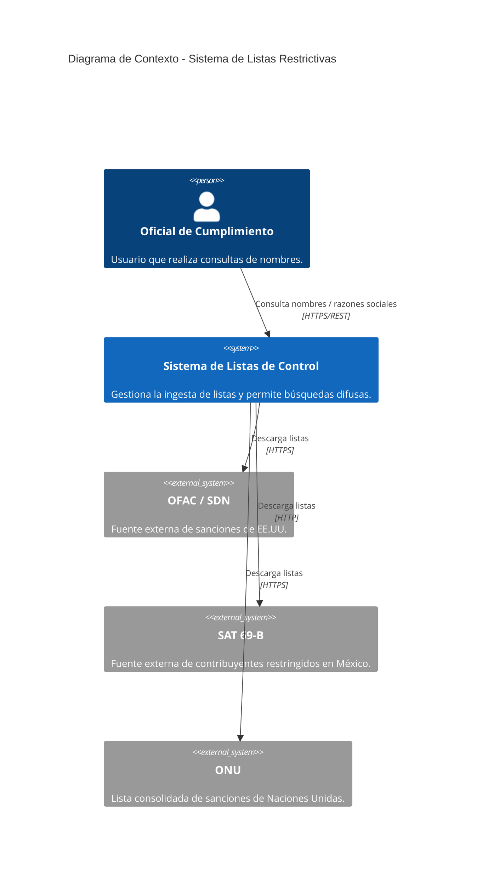
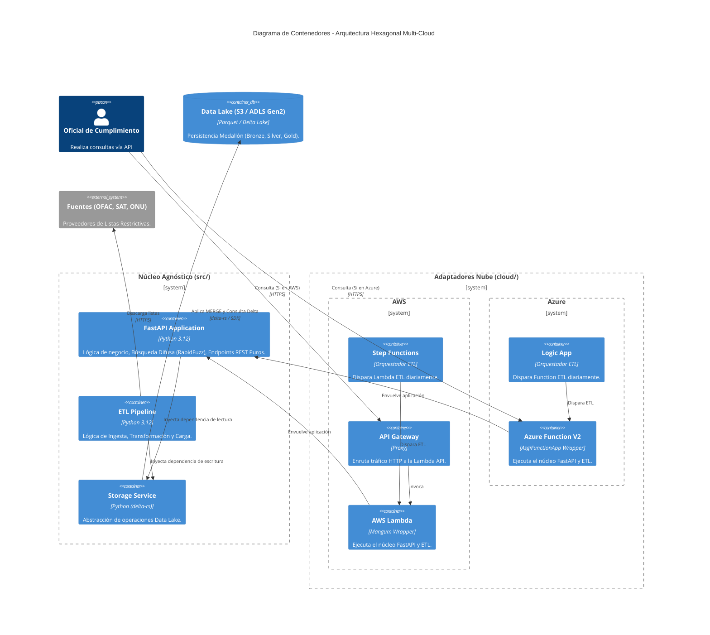

# Arquitectura del Sistema - C4 Model

Este documento describe la arquitectura del sistema de consulta de listas restrictivas utilizando el modelo C4.

## 1. Nivel 1: Diagrama de Contexto
El sistema interactúa con los oficiales de cumplimiento y fuentes de datos gubernamentales externas.

## 2. Nivel 2: Diagrama de Contenedores (Arquitectura Hexagonal Multi-Cloud)
Detalle de la arquitectura agnóstica que soporta despliegues nativos tanto en AWS como en Azure usando adaptadores.

## 3. Flujo de Datos (Arquitectura Medallón)

El almacenamiento subyacente depende de la nube desplegada (S3 para AWS o Blob Storage / ADLS Gen2 para Azure), pero el flujo permanece constante gracias a `delta-rs`.

1.  **Ingesta (Bronze)**: El servicio descarga los archivos originales (CSV/XML) mapeados inyectados por la infraestructura, y los guarda en parquet.
2.  **Transformación (Silver)**: Los nombres se limpian (mayúsculas, sin acentos, sin stop words) utilizando `src.etl.normalization` y se genera un esquema unificado con `id_fuente`.
3.  **Carga (Gold)**: Mediante el `StorageService` se aplica un `MERGE` atómico en una tabla Delta Lake única, particionada por fuente.
4.  **Consulta**: `src/api/v1/search.py` (FastAPI) recibe las peticiones, cruza los datos con la capa Gold en memoria parcial usando `rapidfuzz` para coincidencias de alta confiabilidad.

## 4. Nomenclatura, Seguridad y Despliegues

- **Seguridad y Permisos**:  
  Completamente delegados a la nube mediante Roles y Managed Identities asociadas a la política de mínimo privilegio (`Storage Blob Data Contributor/Reader` y roles equivalentes de S3 IAM).  
- **Inyección de Dependencias**: 
  Las URLs origen y nombres físicos de bucket/storage no están hardcodeadas, se inyectan como variables de entorno (usando `pydantic-settings` en `src/core/config.py`) desde el **IaC** (AWS SAM Template o local.settings.json en Azure).
- **Convención Naming**: 
  Cualquier despliegue debe llamarse: `reinesdev-[app]-[recurso]-[entorno]`. Ej: `reinesdev-compliance-api-prd`.
