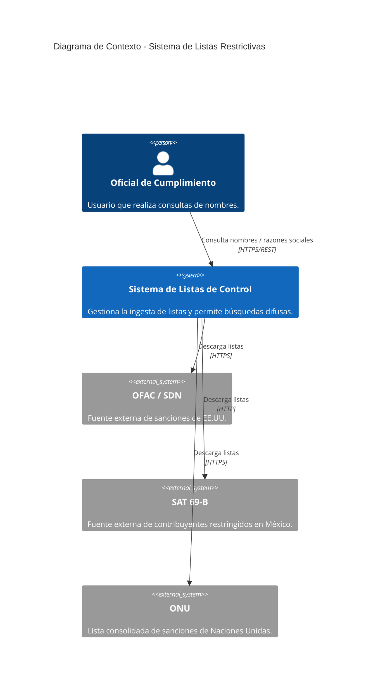
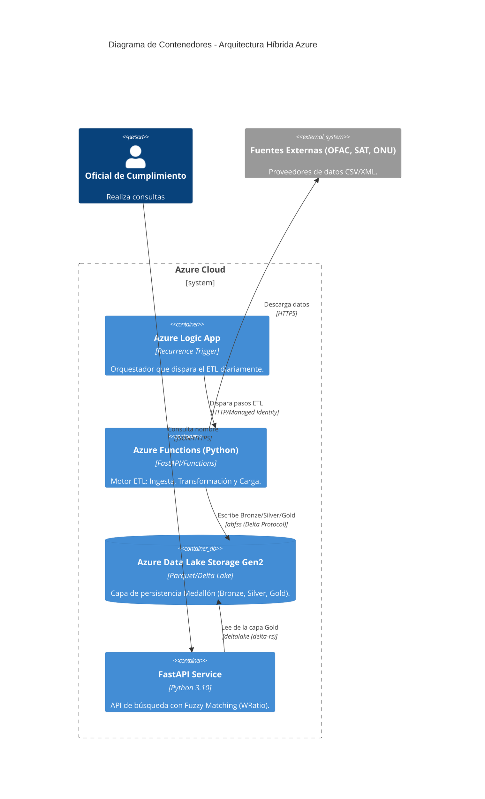

# Arquitectura del Sistema - C4 Model

Este documento describe la arquitectura del sistema de consulta de listas restrictivas utilizando el modelo C4.

## 1. Nivel 1: Diagrama de Contexto
El sistema interactúa con los oficiales de cumplimiento y fuentes de datos gubernamentales externas.



## 2. Nivel 2: Diagrama de Contenedores
Detalle de los servicios en Azure y cómo se comunican entre sí.



## 3. Flujo de Datos (Arquitectura Medallón)

1.  **Ingesta (Bronze)**: La Azure Function descarga los archivos originales (CSV/XML) y los guarda en Parquet crudo.
2.  **Transformación (Silver)**: Se aplica la lógica de `shared/normalization.py`. Los nombres se limpian (mayúsculas, sin acentos, sin stop words) y se genera un esquema unificado.
3.  **Carga (Gold)**: Se realiza un `MERGE` atómico en una tabla Delta Lake particionada por fuente.
4.  **Consulta**: La API recibe un nombre, lo normaliza y utiliza `rapidfuzz` sobre los datos de la capa Gold para devolver coincidencias con score de confianza.

## 4. Seguridad
- **Autenticación**: Managed Identity (System Assigned).
- **Autorización**: RBAC (Storage Blob Data Contributor/Reader).
- **Secretos**: No se utilizan llaves de acceso en el código ni en configuraciones.
```
