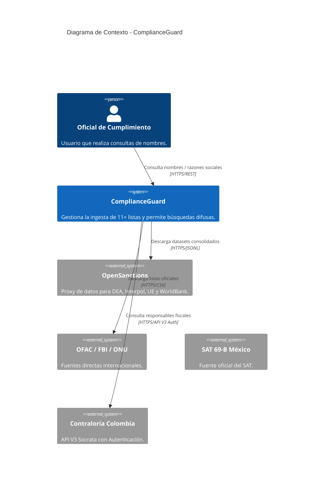
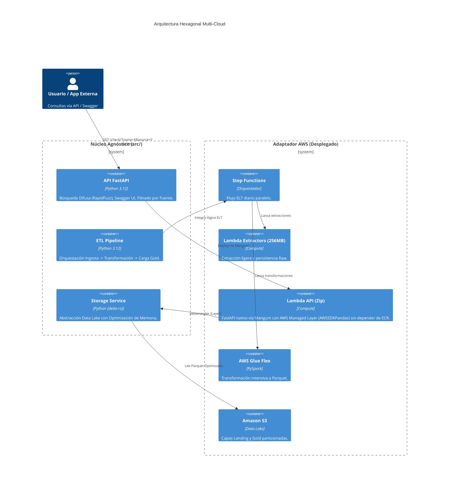

# Arquitectura del Sistema - ComplianceGuard

Este documento describe la arquitectura de alta disponibilidad y agnóstica a la nube para el sistema de consulta de listas restrictivas.

## 1. Nivel 1: Diagrama de Contexto
El sistema interactúa con oficiales de cumplimiento y un ecosistema diverso de fuentes internacionales y regionales.

## 2. Nivel 2: Diagrama de Contenedores (Arquitectura Hexagonal)
Detalle del diseño desacoplado que permite la portabilidad total entre AWS y Azure.

## 3. Flujo de Datos y Optimización

### Estrategia de Ingesta Híbrida
Debido a bloqueos de IP en nubes públicas, el sistema utiliza un enfoque triple:
1.  **Directo:** OFAC, ONU, FBI, FTO y SAT descargados desde servidores oficiales.
2.  **Proxy (OpenSanctions):** DEA, Interpol, UE y WorldBank obtenidos vía datasets estructurados JSONL.
3.  **Autenticado:** Contraloría de Colombia vía API V3 con credenciales de Socrata.

### Rendimiento del Motor de Búsqueda
*   **Volumen:** ~58,500 registros unificados.
*   **Memoria:** Uso de 3GB de RAM en Lambda para mantener el DataFrame de búsqueda en caliente.
*   **Columnas Ligeras:** Solo se cargan 5 campos críticos (`nombre_limpio`, `nombre_original`, `fuente`, `tipo_lista`, `metadata`) para maximizar la velocidad y estabilidad.

## 4. Seguridad y Gobernanza
*   **Identidad:** Acceso a S3 vía IAM Roles (Amazon) y Managed Identity (Azure).
*   **Secretos:** Credenciales de Datos Abiertos inyectadas vía variables de entorno en el despliegue de IaC.
*   **Documentación:** OpenAPI 3.1 / Swagger UI activo para integración simplificada.
