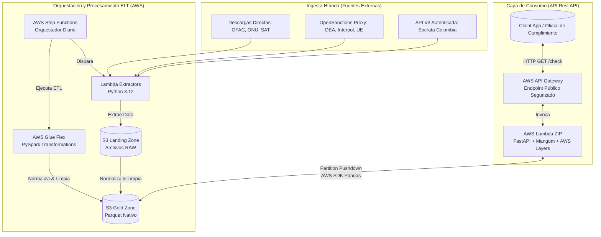

# ComplianceGuard: Global Sanctions & Compliance Hub 🛡️

**Resolviendo los Retos de AML y KYC a Escala Global**

ComplianceGuard es una plataforma integral de **Cumplimiento Normativo (AML/KYC)** diseñada para centralizar, unificar y exponer más de 11 listas restrictivas y de sanciones globales (OFAC, ONU, DEA, Interpol, SAT 69-B, Banco Mundial, etc.) en un único **Data Lakehouse** de alto rendimiento. Construida bajo una filosofía Serverless y Agnóstica a la Nube (AWS/Azure), permite a los Oficiales de Cumplimiento detectar riesgos reputacionales y financieros en milisegundos a través de un motor fonético avanzado de búsqueda.

---

## 🏗️ Arquitectura de la Solución (Multi-Cloud Context)

El núcleo del sistema emplea una **Arquitectura Hexagonal (Ports and Adapters)**, logrando el aislamiento total entre las reglas de negocio y los proveedores cloud. Actualmente, la infraestructura productiva orquesta el flujo en AWS (Data Lakehouse ELT) pero es adaptable nativamente a Microsoft Azure.



---

## � API de Consulta y Autenticación

El sistema expone endpoints RESTFul de alto performance asegurados mediante API Keys (Throttling y Quotas) y documentados bajo OpenAPI 3.1.

### 🔐 Guía de Autenticación y Límites de Uso
Todas las consultas a endpoints protegidos deben incluir el header de autenticación `x-api-key`. La infraestructura configurada a nivel API Gateway (*Usage Plans*) aplica los siguientes límites estrictos para prevenir abusos de la nube:

| Métrica de Seguridad | Límite Configurado (Plan Estándar AWS) |
| :--- | :--- |
| **Quota Mensual** | 1,000 peticiones / mes |
| **Rate Limit** | 5 peticiones / segundo |
| **Burst Limit** | 10 peticiones concurrentes |

### 🧭 Tabla de Endpoints

| Endpoint | Método | Descripción | Parámetros | Request Auth |
|---|---|---|---|---|
| `/prod/check/` | `GET` | Búsqueda Difusa (Fuzzy Match). | `name` (String, req) <br> `threshold` (Int, opt, def: 85) | `x-api-key` en headers |
| `/prod/docs` | `GET` | Interfaz interactiva Swagger UI. | N/A | Público |
| `/prod/openapi.json`| `GET` | Manifiesto de OpenAPI en JSON. | N/A | Público |

**Ejemplo de Petición cURL:**
```bash
curl -X 'GET' \
  'https://<aws-api-id>.execute-api.us-east-1.amazonaws.com/prod/check/?name=carlos%20lopez' \
  -H 'accept: application/json' \
  -H 'x-api-key: TU_API_KEY_SECRETA'
```

---

## 🚀 Guía de Despliegue e Infraestructura como Código (IaC)

Toda la infraestructura de ComplianceGuard se despliega utilizando **AWS SAM (Serverless Application Model)** o **GitHub Actions** hacia AWS. El código base minimiza los tiempos de *Cold Start* utilizando **AWS Lambda (ZIPs)** nativos enlazadas a capas de código pre-compiladas oficiales por Amazon (`AWSSDKPandas`).

### 1. Despliegue Automático (CI/CD)
El repositorio cuenta con integración continua total. Existen mecanismos "Quality Gates" (`Test & Quality Gate` workflow) que aseguran la aprobación de la suite `pytest` para cualquier cambio. Para desplegar a producción la infraestructura y el backend funcional:
- Aumente un Pull Request hacia la rama `main`.
- Al realizar el `Merge`, GitHub interviene y ejecuta automáticamente el archivo `.github/workflows/deploy-production.yml`, lanzando las formaciones robustas de recursos a AWS.

### 2. Despliegue Manual (Línea de Comandos local)
Para aprovisionar manualmente o en un ambiente personal (sandbox de AWS), asegúrse de tener configuradas sus credenciales IAM (`aws configure`) e IAM Roles aptos para CloudFormation.

```bash
# Integrar dependencias y empaquetar el ecosistema (Lambda Functions Zip, etc)
sam build -t infra/root-template.yaml

# Despliegue guiado iterativo a la nube de AWS
sam deploy --guided
```

Adicionalmente, se dispone de un utilitario general PowerShell embebido para facilitar ejecuciones repetitivas en Windows:
```powershell
.\deploy_aws.ps1
```

---

## 📂 Organización del Repositorio

- `src/`: Core agnóstico y puramente de Python. Endpoints API (`api/`), modelos y analíticas.
- `infra/`: Plantillas IaC CloudFormation en formato SAM (`foundation.yaml`, `api.yaml`, `extractors.yaml`).
- `lambdas/`: Envoltorios y scripts de Ingesta nativa hacia S3 especificos por fuente.
- `tests/`: Baterías en Pytest (Unitaria, Integración a Mocks, y E2E en AWS nativo).
- `.github/workflows/`: Pipelines YAML definitorios para automatización MLOps/DataOps en el repositorio.
