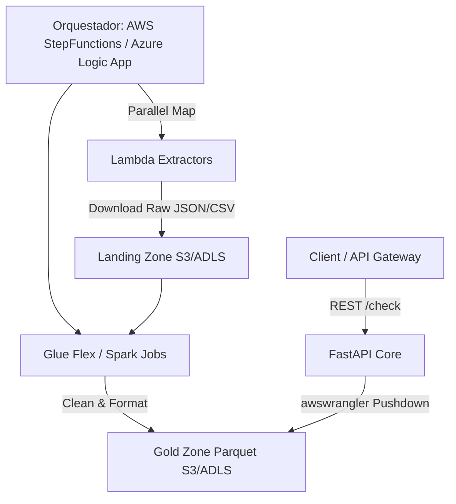

# Sistema de Consulta de Listas Restrictivas (Compliance) 🛡️

Solución Multi-Cloud escalable para la gestión y consulta de listas restrictivas (OFAC, ONU, SAT69B, UE, DEA, LPB, IRAQ, PEP). Implementa una **Arquitectura Data Lakehouse ELT** sobre **AWS Glue y S3 Parquet Nativo**, diseñada con el patrón **Hexagonal Light** para potenciar el análisis concurrente con **FastAPI Core**.

---

## 🚀 Características Principales

- **Arquitectura Hexagonal (Agnóstica a la Nube)**: La lógica de negocio está totalmente aislada en `src/`. Esto permite desplegar exactamente el mismo código base en diferentes orquestadores.
- **ELT Data Lakehouse**: Implementación eficiente con extracciones ligeras (Step Functions + Lambdas) y transformaciones masivas centralizadas en **AWS Glue Flex (PySpark)** sobre S3 Parquet.
- **Partition Pushdown**: Búsqueda asombrosamente rápida y de bajo consumo de RAM utilizando lectura columnar optimizada con `awswrangler` sobre el Catalogo de Datos de AWS Glue.
- **Fuzzy Matching Inteligente**: Búsqueda difusa de alta precisión utilizando el algoritmo WRatio de `rapidfuzz`.

---

## 🏗️ Arquitectura ELT (Multi-Cloud Ready)



## 📂 Estructura del Proyecto

Todos los desarrollos deben realizarse en la capa conceptual correspondiente:

*   **`src/`:** Núcleo (Core). Contiene modelos Pydantic, endpoints (`api/v1/search.py`) y lógica pura ETL.
*   **`infra/`:** Plantillas de Infraestructura como Código (IaC) en CloudFormation/SAM (`foundation.yaml`, `root-template.yaml` y `nested/`).
*   **`lambdas/`:** Scripts nativos de extracción de las distintas fuentes (OFAC, ONU, etc).
*   **`tests/`:** Suite de validación Pytest exhaustiva E2E y Unitaria.

---

## 🛠️ Desarrollo Local y Pruebas

### 1. Levantar la API en Local (Modo Agnóstico)
No necesitas levantar Docker para probar la API. Simplemente asegúrate de tener las variables de entorno configuradas (`.env` con tu bucket/storage account).
```bash
python -m uvicorn src.api.main:app --reload
```
Abre en tu navegador: `http://localhost:8000/docs`

### 2. Ejecutar Unit Tests
```bash
python -m pytest tests/unit/ -v
```

---

## ☁️ Nomenclatura Estricta (Naming Convention)

Todos los recursos se crean mediante Infraestructura como Código (IaC) y siguen rígidamente esta convención:
`reinesdev-[nombre_app]-[recurso]-[entorno]` (Ej: `reinesdev-compliance-api-prd`)

---

## 🚀 Despliegues

### AWS (Vía SAM CLI / GitHub Actions)
El backend está impulsado por **AWS Lambda (Python 3.12 ZIPs)**. Para evadir los límites de tamaño de paquete, se utilizan **AWS Managed Layers** oficiales (como `AWSSDKPandas-Python312`). La orquestación diaria del ETL corre mediante Step Functions.
```bash
sam build -t infra/root-template.yaml
sam deploy --guided
```

### Azure
En el directorio `cloud/azure/` y configurando el contenedor en `docker/Dockerfile.azure` se encuentra la base para acoplar GitHub Actions hacia Azure Container Apps o Functions V2.
