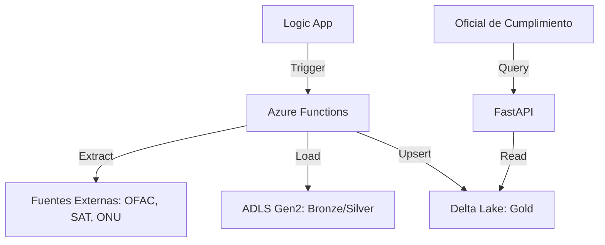

# Sistema de Consulta de Listas Restrictivas (Compliance) 🛡️

Solución híbrida escalable en **Azure** para la gestión y consulta de listas restrictivas (OFAC, ONU, SAT69B, UE, DEA, LPB, IRAQ) utilizando una **Arquitectura Medallón** sobre **Delta Lake**.

---

## 🚀 Características Principales

- **Arquitectura Medallón**: Capas Bronze, Silver y Gold para máxima trazabilidad y calidad de datos.
- **Delta Lake Local & Cloud**: Implementación eficiente con `delta-rs` para lectura directa de ADLS Gen2 sin necesidad de Spark.
- **Fuzzy Matching Inteligente**: Búsqueda difusa avanzada utilizando algoritmos de `rapidfuzz` (Levenshtein y WRatio) con scores de confianza del 0 al 100.
- **Normalización Corporativa**: Limpieza automática de nombres, eliminando sufijos (S.A., LLC, SAS), acentos y caracteres especiales.
- **Infraestructura Serverless**: Azure Functions y Logic Apps para una orquestación diaria de bajo costo.
- **Seguridad Empresarial**: Autenticación mediante **Managed Identities (RBAC)**, eliminando el uso de llaves estáticas.

---

## 🏗️ Arquitectura

El sistema está diseñado siguiendo el modelo C4 para máxima claridad técnica. Puedes consultar el detalle en [ARCHITECTURE.md](ARCHITECTURE.md).



---

## 🛠️ Configuración Local (WSL)

### Requisitos Previos
- Python 3.10 o superior (instalado en WSL).
- Azure CLI configurado.
- Acceso al Storage Account de Azure `listasdeltalake`.

### Instalación
1. Clonar el repositorio.
2. Crear y activar el entorno virtual:
   ```bash
   python3 -m venv .venv
   source .venv/bin/activate
   ```
3. Instalar dependencias:
   ```bash
   pip install -r requirements.txt
   ```
4. Configurar el archivo `.env` basado en la documentación técnica.

---

## 🧪 Pruebas y Ejecución

### Pruebas Unitarias
```bash
pytest tests/unit
```

### Ingesta Manual (Prueba de Campo)
```bash
PYTHONPATH=. python3 tests/test_full_ingest.py
PYTHONPATH=. python3 tests/test_full_transform.py
PYTHONPATH=. python3 tests/test_full_load.py
```

### Ejecutar API de Consulta
```bash
PYTHONPATH=. python3 api/main.py
```
Acceso a Swagger: `http://localhost:8000/docs`

---

## ☁️ Despliegue en Azure

El proyecto incluye un script maestro de despliegue en PowerShell que aprovisiona la infraestructura y configura la seguridad:

```powershell
.\infrastructure\deploy.ps1
```

---

## 📂 Documentación Detallada

- **[PROJECT_OVERVIEW.md](PROJECT_OVERVIEW.md)**: Manual técnico completo, diccionario de variables y guía de seguridad.
- **[ARCHITECTURE.md](ARCHITECTURE.md)**: Diagramas C4 detallados.
- **[LINKEDIN_ARTICLE.md](LINKEDIN_ARTICLE.md)**: Contexto estratégico y casos de uso en el sector financiero.

---

## 👥 Contribuciones
Este proyecto utiliza estándares de codificación limpios y robustos. Para añadir una nueva lista restrictiva, crea un módulo en `azure_functions/ingest/` y añade la URL en las variables de entorno.
