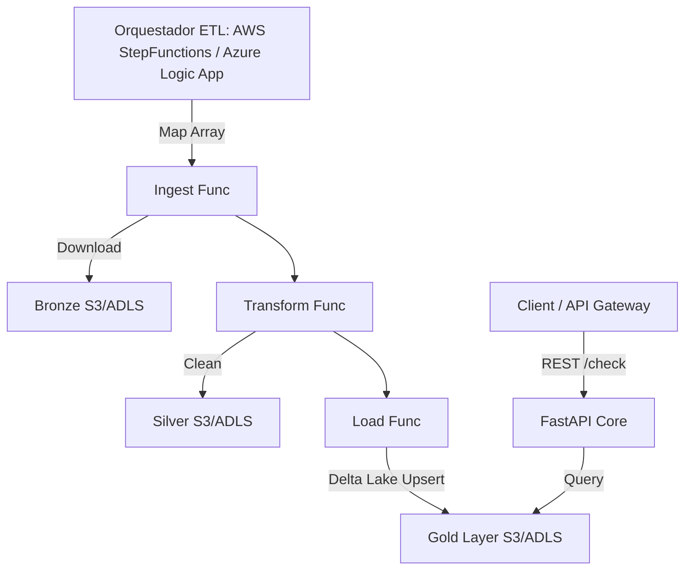

# Sistema de Consulta de Listas Restrictivas (Compliance) 🛡️

Solución Multi-Cloud escalable para la gestión y consulta de listas restrictivas (OFAC, ONU, SAT69B, UE, DEA, LPB, IRAQ). Implementa una **Arquitectura Medallón** sobre **Delta Lake**, diseñada con el patrón **Hexagonal Light** para ser 100% agnóstica a la nube mediante **FastAPI Core**.

---

## 🚀 Características Principales

- **Arquitectura Hexagonal (Agnóstica a la Nube)**: La lógica de negocio está totalmente aislada en `src/`. Esto permite desplegar exactamente el mismo código base como AWS Lambdas/StepFunctions o como Azure Functions/LogicApps sin modificar el núcleo.
- **Delta Lake Local & Cloud**: Implementación eficiente con `delta-rs` para lectura/escritura directa a ADLS Gen2 o Amazon S3 Bucket sin necesidad de clústeres Apache Spark.
- **Fuzzy Matching Inteligente**: Búsqueda difusa de alta precisión utilizando el algoritmo WRatio de `rapidfuzz`.
- **API Moderna (FastAPI)**: Documentación automática en Swagger, esquemas Pydantic y un rendimiento veloz.

---

## 🏗️ Arquitectura (Multi-Cloud Ready)



## 📂 Estructura del Proyecto

Todos los desarrollos deben realizarse en la capa conceptual correspondiente:

*   **`src/`:** Núcleo (Core). Contiene modelos Pydantic (`api/schemas.py`), endpoints (`api/v1/search.py`) y lógica pura ETL.
*   **`cloud/`:** Adaptadores por nube, Infraestructura como Código (IaC) y scripts de despliegue.
    *   `aws/`: Contiene envoltorios Mangum para API, el `template.yaml` para despliegues con AWS SAM, y scripts como `deploy_aws.ps1`.
    *   `azure/`: Contiene la configuración Azure Functions V2, `logic_app.bicep` para orquestación, scripts de despliegue (`deploy_az.ps1`) y utilidades de almacenamiento.
*   **`docker/`:** Contenedores de empaque. Para AWS (Lambda Image) o Azure.
*   **`tests/`:** Suite de validación Pytest exhaustiva.

---

## 🛠️ Desarrollo Local y Pruebas

### 1. Levantar la API en Local (Modo Agnóstico)
No necesitas levantar Docker para probar la API. Simplemente asegúrate de tener las variables de entorno configuradas (`.env` con tu bucket/storage account).
```bash
python -m uvicorn src.main:app --reload
```
Abre en tu navegador: `http://localhost:8000/docs`

### 2. Ejecutar Unit Tests
```bash
python -m pytest tests/unit/ -v
```

---

## ☁️ Nomenclatura Estricta (Naming Convention)

Todos los recursos se crean mediante Infraestructura como Código (IaC) y siguen rígidamente esta convención:
`reinesdev-[nombre_app]-[recurso]-[entorno]` (Ej: `reinesdev-compliance-api-prd`)

---

## 🚀 Despliegues

### AWS (Vía SAM CLI)
El despliegue primario se soporta con contenedores Serverless (AWS Lambda Images) orquestados mediante AWS Step Functions.
```bash
sam build --template cloud/aws/template.yaml --use-container
sam deploy --guided
```

### Azure
En el directorio `cloud/azure/` y configurando el contenedor en `docker/Dockerfile.azure` se encuentra la base para acoplar GitHub Actions hacia Azure Container Apps o Functions V2.
